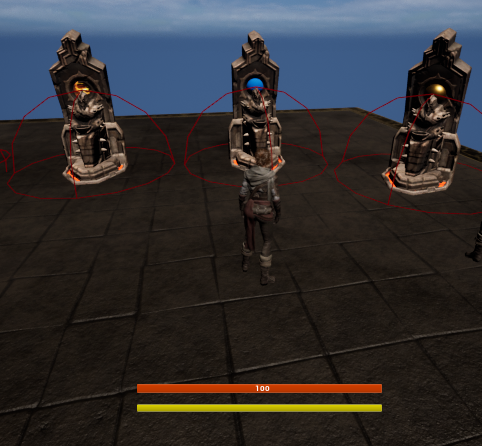
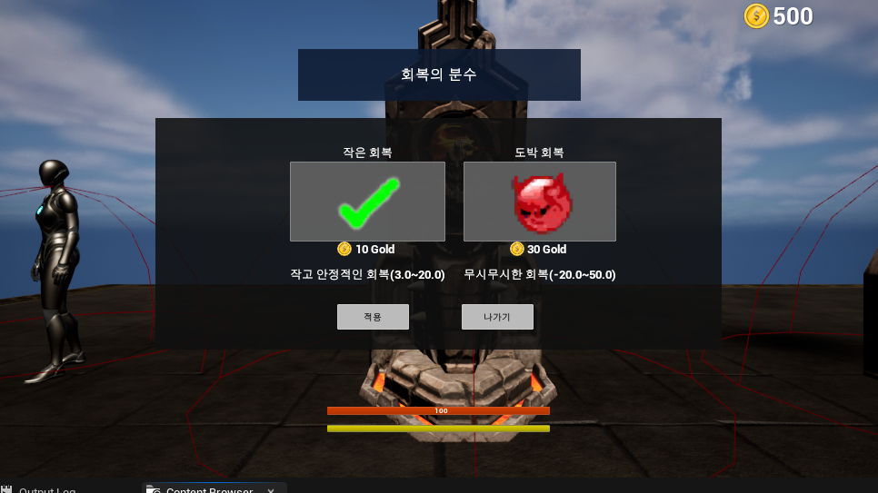
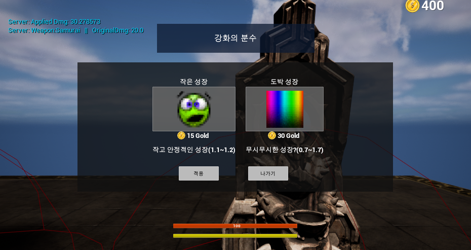
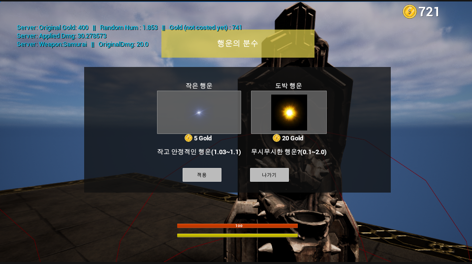

# [GoldKing] ClientTeam (230918)

## Today's Task

  ### 1. 데일리 스크럼 및 JIRA 스프린트 생성
  - 팀별 로드맵 공유
    - [서버팀](https://gainful-pineapple-5a6.notion.site/3-8c00d15f802f4b36b8781192d58a0e4e?pvs=4) 
    - [클라이언트팀](https://gainful-pineapple-5a6.notion.site/2-6625b1e641de4fc3a487e8e7c536f7d7?pvs=4)
  - JIRA
    - (9/22) 1차 배포를 위한 Project Managing
  

  ### 2. 행운의 분수 (상점기능 심화) 3개 구현
  - HP회복 분수 / 능력치 강화 분수 / 금화 분수
  - 두 종류의 아이템 존재
    - Low Risk Low Return / High Risk High Return
  - BugFix
 
  ### 3. Random Spawn Point 생성
  - Player 
    - 스폰포인트 지정 후 랜덤배치
    - (중복방지) 입장 전 index의 랜덤조합 뽑아 부여한 뒤, vector location array에 접근하여 스폰 
  - 무기상점
    - Player 스폰지점 근처(반경)에 랜덤으로 spawn
  - 행운의 분수
    - 맵 전체에 스폰포인트 지정 후 중복방지하여 스폰

  
-------------------
## 회의록
  - [스크럼 회의](https://gainful-pineapple-5a6.notion.site/19-29aa3f095aef4697a6ffe239111fdab3?pvs=4)
  - Server
    - user info 
      - (ID, Nickname, PW) 길이 및 포맷 제한 여부 
    - Perforce 서버 다운 관련 Issue 

## TIL 
### [Unreal Engine Multiplayer Framework](https://www.youtube.com/watch?v=Hsr6mbNKBLU)
  - Core
    - **GameMode**
      - *Server Only*
      - 게임에 대한 룰을 정의하고 Score 등을 추적할 수 있다 
      - GameMode (Inherited) / GameModeBase (Parent)
        - 멀티플레이어 환경 구축을 위해서는, 전용 기능이 더 많은 GameMode를 쓴다
          - match state events 
        - 싱글플레이면 GameModeBase도 무방  
    - **GameState**
      - *Server & Clients*
      - 게임의 상태를 정의하고 그에 관련한 정보를 추적할 수 있다.
      - **Replicate 자동지원**
      - GameState (Inherited) / GameStateBase (Parent)
      - 마찬가지로 멀티플레이어 환경 구축엔 GameState 권장
      - GameState - GameMode 일치시키기 (둘중 하나는 Base고 하나는 일반이면 안됨)
    - **Player State**
      - *Server & Clients*
      - 모든 서버 플레이어에 대한 상태 및 정보 저장 
      - **Replicate (to client) 자동지원**
      - 플레이어 정보(id, name, score, level, exp, guildId, 업적 및 칭호 등) 변수화하여 저장하는 데 용이함 
    - **Player Controller**
      - *Server & Owning Clients*
      - Player의 입력 및 조작 관련 처리(키보드, 마우스 등)를 하는 곳 
      - User Interface 생성 및 관리에 매우 용이함 

 

###  Structure 
  - **먼저, GameMode (server only)에서 유저들의 리스폰과 관련된 로직을 처리함** 
  - **스폰과 동시에 PlayerController (server & owning cli)에서 처리 진행됨**
    - Server = your pc on server
    - Owning Clients = you on your PC (Local)
    - RPC만 해준다면 Server -> Local 계속 Correcting처리 진행
    - 예시) 리스폰 관련 로직 처리
      - PlayerController에서 입력에 따른 Custom Event 생성(cli)
      - 또다른 ServerSide Custom Event 생성(serv)
        - Replicate : On server 설정 
        - Reliable : Checked (Network를 확실히 거쳐야 하는 경우)
      - 입력-> cli Custom Event -> ServerSide Custom Event 연결
        - 서버에 정보 전달 
      - ServerSide Custom Event -> Cast to BP_Gamemode -> 해당 로직의 event 연결
        - 서버에서 실행 
  - **GameState, PlayerState 에서 게임에 대한 정보를 얻어 실시간으로 반영하고 저장함**
    - Global Store의 역할 (Web에서의 React Redux처럼)
    - Client가 Store로 Fetch하기만 하면 자동으로 RPC됨  
    - **GameState** 
      - ex) Team_A_Score, Team_B_Score, All_PlayerControllers, All_PlayerStats
    - **PlayerState**
      - ex) Username
    - **Pawn(BP_Character)**
      - ex) Health, Stats

  - **Widgets (Owning Clients only)에서 Global Info를 가져다 쓰는 경우**
    - Cast to BP_GameState(PlayerState) -> get variable -> to local widget

 

### Possess? (Important)
  - PlayerController가 Pawn(BP_Character)의 상위에 존재함
    - 만약 P.C와 Pawn에 같은 입력이 동시에 들어간다면 PC의 입력으로 처리 
  - PlayerController는 Pawn을 ***"Possess"*** 할 수 있음  
    - 기본적으로 pawn이 server, client 양쪽 동시에 생성되지만, 
    - Controller가 달리지 않은 채로 생성이 됨. 그냥 존재할 뿐
    - 만약 이런 상태에서 P.C와 Pawn에 같은 입력을 받는 로직이 있다면
      - 이런 경우에는 예외적으로 Pawn에서의 입력이 우위를 가짐 

 

### Widgets (Owning Client - Local)
- Widgets는 Replicate가 불가능하다 - (로컬에만 존재할 수 있기 때문).
  - 단지 PlayerController가, 서버에서 로컬로 정보를 전달해 
  - Widget을 통해 "display"시킨다.
- 그러나 만약 Widget상에 특정 Input을 통해 실행되는 무언가가 있다면
  - 그것을 PlayerController를 통해 전달해 GameMode, GameState, PlayerState 등에 접근하여 실행하는것은 가능하다 

   

## 클라이언트 진행상황  

### 3 Fountains
- <HP / Stats / Gold> Fountain 기초 
  
    

### Use of Each
- HP Fountain  
  
    

- Stats Fountain 
  
    

- Gold Fountain 
  
    
  
  골드 계산은 (원래 보유골드 * Random Float - 분수 비용)으로 하였음  
  

    
  