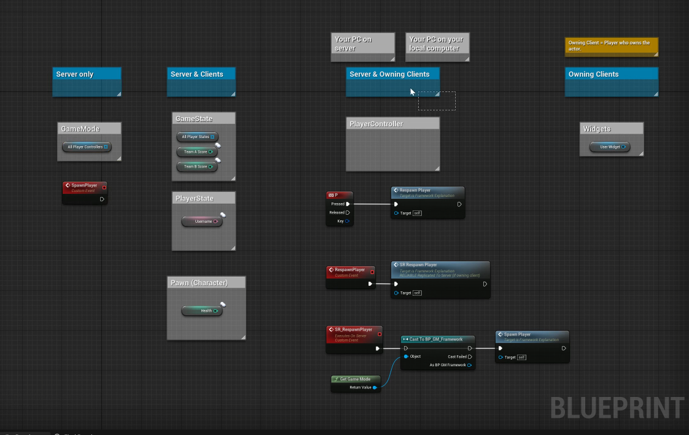
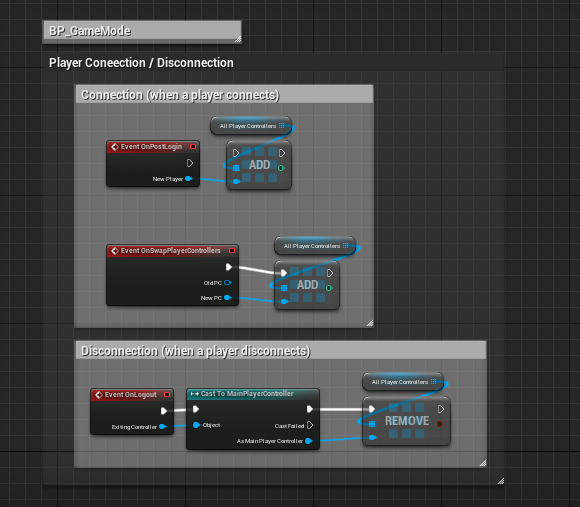
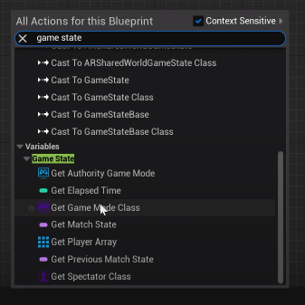
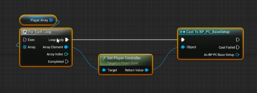

# [GoldKing] ClientTeam (230919)

## Today's Task

  ### 1. 데일리 스크럼 및 JIRA세팅
  
  ### 2. GameManager Framework 세팅 
  - GameMode, PlayerController
  - GameState, PlayerState
  
  ### 2. Player Spawn / Respawn 구현 
  - Event Death -> Re
  
  ### 3. Random Spawn Point 생성
  - Player 
    - 스폰포인트 지정 후 랜덤배치
    - (중복방지) 입장 전 index의 랜덤조합 뽑아 부여한 뒤, vector location array에 접근하여 스폰 
  - IfNumExist Array(visited)를 쓰면 비효율
    - 플레이어 스폰은 세션당 플레이어 수 적어서 상관 없는데
    - 랜덤분수 스폰포인트는 몇 십개~ 몇 백개가 될 수 있으므로 계속 Random 돌리면 로직 효율이 급격히 떨어짐
    - Unordered_map과 같은 HashMap 자료구조 사용하여 체크   

  
-------------------
## 회의록
  - [스크럼 회의](https://gainful-pineapple-5a6.notion.site/20-2f7d00ef90e94d51a3cb808c2be4ed27?pvs=4)
  - Server
    - Coturn 방식 네트워크 테스트
    - 병목현상 발생 
      - (특히 서버가 클라이언트의 정보를 잘 못 받음 in SSAFY) 
      - 다른 방안이 필요하지 않나..

## TIL 
### [Unreal Engine Multiplayer Framework](https://www.youtube.com/watch?v=pvDgmnxewuk&list=PLNb7FZ2Nw2HTcJ9Qvy8n2Ou-ZVbsDOMFh&index=5) 
 
  ### **GameMode** (only server)
  - 게임 내 Player Controller를 수집 및 추적 (keep track)
  - 게임의 시점과 관련된 룰과 로직을 처리 후  서버->클라로 전달  
   

  - Event OnPostLogin
    - 세션이 시작되었을 때 입장(성공적으로 로그인)된 시점
    - P.C(player controller)가 성공적으로 부여된 시점
    - 이 때를 기점으로 플레이어의 정보를 보관 / 관리 시작
      - All_PC (P.C arr)
        - Array에 add하여 player를 등록
    - ex) 30초 후에 유저들이 지정된 곳에서 스폰됨  

  - Event OnSwapPlayerControllers
    - 세션 연결 후 PC에 변동이 생기게 되는 경우
      - 레벨 이동, 재참가(?)
      - 레벨이 바뀌면 GameMode가 재설정(재실행)되는데, 
      - 이 때 이전의 P.C 정보를 넘겨주는 역할    

  - Event OnLogout
    - 로그아웃한 플레이어를 제거하는 데 사용
      - BP_P.C에 casting을 거쳐 Arr REmove에 꽂아줘야함
    - pin "Existing Controller" 
      - (Controller obj ref type)로, 핀타입이 다름
      - 위의 다른 event들은 (P.C obj ref type)
      - All_P.C array에 pin 연결 불가   

  - Replicate??
    - 불가능
    - server / clients로 이루어진 FrameWork에서만 가능
      - GameState, PlayerState, P.C, Pawn(CharacterBP)   

### **GameState** (server, clients)
- GameMode가 시작될 때 모든 PlayerState를 수집/트래킹함
- GameState 고유의 Variable(기능변수)들이 있음 
    

- 이 중 가쟝 유용한 것은 역시 PlayerArray임 
  - GameMode에서 Set했지만, Replicate할 수 없는 한계를 극복
  - 하지만 GameState에서 Set할수는 없다는 한계 
- 따라서, Player Info(arr)는 
  - GameMode에서 Set(조작)하고 
  - GameState에서 Get하여 Replicate한다

- 사실 아까 GM에서 세팅한 유저 정보 저장은
    
- 위와 같이 GameState에서도 세팅 가능하다  

### **PlayerController**
  - Initialize Player Data (플레이어 정보 초기화)
### **PlayerState**
  - player가 선택한 정보 (아바타, 세팅) 적용 및 replictae 

----

## 클라이언트 진행상황  

<!-- ### 3 Fountains
- <HP / Stats / Gold> Fountain 
    
### Use of Each
- HP Fountain 
    

- Stats Fountain 
    

- Gold Fountain
    
  골드 계산은 (원래 보유골드 * Random Float - 분수 비용)으로 하였음   -->
  

    
  