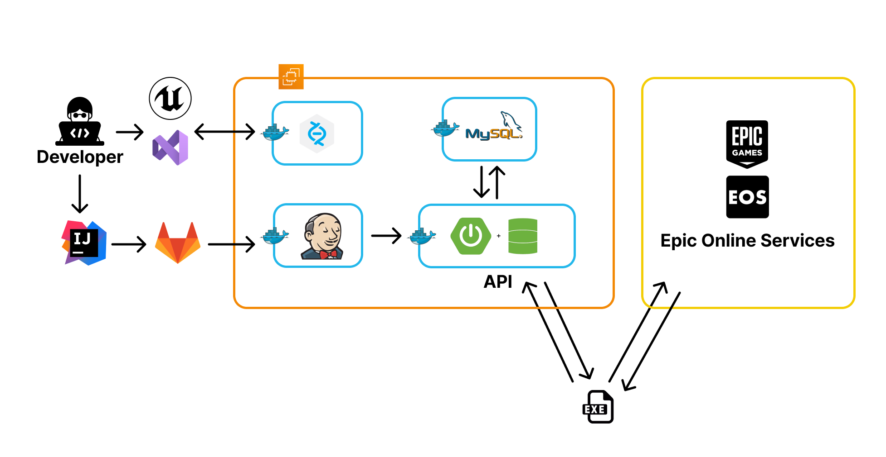

# UE5_GoldKing_Project

[](https://youtu.be/gFAPVcIxiAQ?feature=shared)

[링크 또는 영상을 클릭하면 이동합니다](https://youtu.be/gFAPVcIxiAQ?feature=shared)

<br>

"**황금왕 골드킹**" 은 유적에서 벌어지는 **배틀로얄 장르**의 게임으로,<br/>
다른 플레이어들과의 **전투 혹은 몬스터 사냥을 통해 골드를 획득**하고,<br/>
획득한 골드를 사용하여 **다양한 무기와 마법의 조합**을 통해<br/>
**매 게임 새로운 전투 경험을 느낄 수 있는 게임**입니다.<br/><br/>

<details>
<summary>📖 스토리</summary>
<div markdown="1">

    200년 전, 세상 모든 황금을 모았다 여겨지는 **황금왕 골드킹**..

    어느 날 그의 무덤이 발견되었다는 소문이 들려오며 **탐험가**들이 모여든다.

    탐험가들은 유적 근처 마을의 선술집에서 나와 소문의 유적에 들어서는데,

    유적에서 흘러나오는 이상한 기운 때문에 모두 흩어지고 만다.


    당신은 이 유적에서 **최대한 많은 황금을 갖고 탈출**해야 한다.

    당신에게 주어진 선택은 세 가지.

      첫 번째는 다른 탐험가들과 함께 깨어난 **황금왕을 물리치고** 황금을 나누어 갖고 탈출하는 것.

      두 번째는 다른 탐험가들을 배신하여 **모두 죽이고 혼자 살아남아** 황금을 독차지하고 탈출하는 것.

      세 번째는 …


    **모든 것은 당신의 선택에 달려있다.**

    당신은 과연 무사히 황금을 갖고 살아 나갈 수 있을까..

</div>
</details>

<details>
<summary> 🕹️ 조작법</summary>
<div markdown="1">

    이동 : WASD
    점프 : Space Bar
    앉기 : Ctrl
    벽 넘기 : C
    달리기 : Left Shift
    일반 공격 : Left Mouse Click
    마법(구매 시) : Right Mouse Click
    암살(무기 타입 듀얼블레이드 시) : Right Mouse Click
    공격 대상 타겟팅 : Q
    구르기 : F
    상호작용 : G

</div>
</details>
<br/>

<br/><br/>

# 1. TEAM

### 팀 소개

<table>
  <tr>
    <td align="center"><b>Name</b></td>
    <td align="center"><b>👑윤민영</b></td>
    <td align="center"><b>이정준</b></td>
    <td align="center"><b>김하림</b></td>
    <td align="center"><b>박영서</b></td>
    <td align="center"><b>이 건</b></td>
  </tr>
  <tr>
    <td align="center" vertical-align="middle"><b>BLANCA</b></td>
    <td align="center"></td>
    <td align="center"></td>
    <td align="center"><br /></td>
    <td align="center"><br /></td>
    <td align="center"><br /></td>
  </tr>
  <tr>
    <td align="center"><b>Position</b></td>
    <td align="center"><b>Project Leader</b></td>
    <td align="center"><b>Client Leader <b></td>
    <td align="center"><b>Server Leader</b></td>
    <td align="center"><b>Infra Leader</b></td>
    <td align="center"><b>Testing Leader</b></td>
  </tr>
  <tr>
    <td align="center"><b>Team</b></td>
    <td align="center"><b>클라이언트</b></td>
    <td align="center"><b>클라이언트<b></td>
    <td align="center"><b>서버</b></td>
    <td align="center"><b>서버</b></td>
    <td align="center"><b>서버</b></td>
  </tr>
</table>

<br><br><br>

# 2. Introduction

### 개요

|       팀명        |                                                               A203                                                               |
| :---------------: | :------------------------------------------------------------------------------------------------------------------------------: |
|    프로젝트명     |                                                          황금왕 골드킹                                                           |
| 프로젝트 진행기간 |                                                      2023/8/14 ~ 2023/10/6                                                       |
|     개발 인원     |                                                    5인 (서버 3, 클라이언트 2)                                                    |
|     게임 특징     | - 실시간 멀티플레이어 배틀로얄 게임 <br> - 협동 / 경쟁 / 파밍 등 다양한 플레이 <br> - 랜덤 요소를 가미하여 매 플레이 차별성 보장 |
|    주요 고객층    |                         - **색다른 경쟁**을 즐기고 싶은 유저 <br> - **생동감있는 그래픽**을 원하는 유저                          |

<br/>

### 게임 소개

<details>
<summary>📖 스토리</summary>
<div markdown="1">

    200년 전, 세상 모든 황금을 모았다 여겨지는 **황금왕 골드킹**..

    어느 날 그의 무덤이 발견되었다는 소문이 들려오며 **탐험가**들이 모여든다.

    탐험가들은 유적 근처 마을의 선술집에서 나와 소문의 유적에 들어서는데,

    유적에서 흘러나오는 이상한 기운 때문에 모두 흩어지고 만다.


    당신은 이 유적에서 **최대한 많은 황금을 갖고 탈출**해야 한다.

    당신에게 주어진 선택은 세 가지.

      첫 번째는 다른 탐험가들과 함께 깨어난 **황금왕을 물리치고** 황금을 나누어 갖고 탈출하는 것.

      두 번째는 다른 탐험가들을 배신하여 **모두 죽이고 혼자 살아남아** 황금을 독차지하고 탈출하는 것.

      세 번째는 …


    **모든 것은 당신의 선택에 달려있다.**

    당신은 과연 무사히 황금을 갖고 살아 나갈 수 있을까..

</div>
</details>

<details>
<summary> 🕹️ 조작법</summary>
<div markdown="1">

    이동 : WASD
    점프 : Space Bar
    앉기 : Ctrl
    벽 넘기 : C
    달리기 : Left Shift
    일반 공격 : Left Mouse Click
    마법(구매 시) : Right Mouse Click
    암살(무기 타입 듀얼블레이드 시) : Right Mouse Click
    공격 대상 타겟팅 : Q
    구르기 : F
    상호작용 : G

</div>
</details>
<br/>

### 게임 진행 방식

1. **로그인**
   - 디바이스 기준으로 게임이 저장됩니다.
   - 별도의 회원가입이 필요없으며, 매번 닉네임을 바꾸어 참여할 수 있습니다.
2. **로비**
   - 원정대 생성 - 원정대 생성 시 방장이 되어 게임 시작을 결정할 수 있습니다.
   - 방 참가 - 방장에게 게임 시작 요청을 보내거나 방장이 게임 시작하기까지 대기 후 게임이 시작됩니다.
3. **인게임**
   1. 게임이 시작되면 플레이어가 메인 맵에 스폰되고, 플레이어 주위에 상점 NPC가 생성됩니다.
      - 상점에서 보유중인 골드를 사용하여 무기 혹은 마법을 구매할 수 있습니다.
      - 상점 NPC는 30초가 지나면 자동으로 사라집니다.
   2. 다른 플레이어와의 전투 혹은 몬스터 사냥을 통해 골드를 획득합니다.
   3. 다른 플레이어를 모두 처치하여 최후의 1인이 되거나 탈출하는 방법으로 게임을 마무리할 수 있습니다.

<br/>

### 특장점 및 차별점

- SSAFY 메타버스 게임 **최초 언리얼 엔진**을 이용한 게임 개발
- 언리얼 엔진의 최대 장점인 **고사양 그래픽**
- 메쉬 관리를 통한 **Tick 당 연산량 최소화** - 평균 목표 프레임 유지
- **EOS (Epic Online Subsystem)** 연동을 통한 유저 및 서비스 관리
- **반실사** 기반 캐릭터 및 **화려한 스킬, 다양한 모션**

<br/>

### 반복 플레이 요소

- **여러 탈출 방법**에 따른 다양한 플레이 가능
- **랜덤 요소**를 통한 플레이어 경험 다양화
  - 보스 공격속도, 분수상점 (위치, 종류, 확률), 유저 스폰 위치
- **다양한 무기, 스킬의 조합**으로 매 플레이마다 새로운 경험 가능
  - 무기의 티어 및 숨겨진 기능 존재
- **구르기 시 무적 상태**가 존재하여 다양한 전투 상황 가능
- **보유 중인 골드**에 따라 다양한 플레이 스타일
  - 장비 상인, 분수 상점 등 **골드 소모 컨텐츠** 이용
- **랭킹 시스템** (골드 / 킬 수 /플레이타임)

<br/>

### 주요 기능 & 핵심 기술

- 실시간 멀티플레이
  - Listen Server + Replication
- 리더보드 (랭킹)
  - API서버 ( <- HTTP -> ) 게임 클라이언트
- 사용자 간 채팅 기능
  - UE5 블루프린트
- 다양한 애니메이션
  - UE IK Retargeting / Motion Warping Plugin
- 기타
  - OSS EOS (Online Subsystem Epic Onlie Service)
    - 세션 및 로비 구현 (세션 생성, 파괴, 입장, 검색)
    - 통계 구현 (황금, 킬 횟수, 플레이 횟수)
    - 업적 구현 (통계 항목 기반)
    - Device ID 인증 및 유저 관리

<br/> <br/>

# 3. PROJECT

### 사용기술

<div markdown="1">

|     클라이언트      |           서버            | 인프라  |  디자인   |   협업   |
| :-----------------: | :-----------------------: | :-----: | :-------: | :------: |
| Unreal Engine 5.2.1 |     UE Listen Server      | Docker  | Photoshop | Perforce |
| Visual Studio 2022  |  JAVA Spring Boot (API)   | Jenkins |   Maya    |  GitLab  |
|                     | EOS (Epic Online Service) |         |           |   JIRA   |
|                     |        MySQL (DB)         |         |           |  Notion  |
|                     |                           |         |           |          |

</div>
<br/>

### API 명세서

[API 명세서 노션 링크](https://gainful-pineapple-5a6.notion.site/e92f17bf7d5e4044a6e4359304048465?v=d0859fa50d844805be7f2bbbaefbe61c&pvs=4)

<br/>

### 서비스 아키텍쳐



<br/>

## 그라운드 룰

<div markdown="1">

### 1. Perforce Commit Convention

|     | Category | Information      | Details                                 |
| --- | -------- | ---------------- | --------------------------------------- |
| ✨  | feat     | 기능 구현        | 새로운 기능 추가, 수정                  |
| 🐛  | bugfix   | 버그 수정        | 기능 구현 후 실행 시 발견된 에러 핸들링 |
| 💚  | build    | 빌드 & 배포      | 빌드 및 배포파일 생성시                 |
| 🔀  | save     | 임시 저장        | 로컬의 변경이 있어야 할 경우 사용       |
| 📝  | test     | 테스트 코드 작성 | 테스트를 진행 및 완성에 작성            |
|     |          |                  |

</div>
<br/>

### 2. 기타 협업 관련

<details>
<summary>🥇 프로젝트 수칙</summary>

### 💻 회의 진행

1. 매일 오전 9시, 오후 5시 2회에 걸쳐 **데일리 스크럼(Daily Scrum)**을 진행해, 개인별 당일 목표를 설정하고 진행 상황을 공유합니다.
2. 매주 금요일 오후 5시에 **스프린트 세션(Sprint Session)**을 진행해 일주일간 프로젝트의 진행 상황 및 추후 진행 목표를 설정합니다.
3. 데일리 스크럼과 스프린트 세션은 팀장이 회의를 주재하고, 다른 팀원들이 돌아가며 회의록을 작성합니다.
4. 회의에 적극적으로 참여하고, 팀장의 지목에 따라 본인의 의견을 반드시 제시합니다.

### 💻 코드 리뷰

[코드 리뷰(7/7 라이브 내용)](https://www.notion.so/7-7-39ee72388d9c4e7289ccebc966d4540b?pvs=21)

1. **코드 리뷰(Code Review)**는 점심시간을 활용해 필요한 부분만 진행합니다.
2. 서로 다른 코드 스타일을 합의한 **코딩 컨벤션(Coding Convention)**에 따라 일원화합니다.
   1. 기본 룰을 따르되 코드 리뷰 중 본인만의 괜찮은 컨벤션이 생길 경우 협의 하에 팀 공식 컨벤션으로 정하고 따릅니다.
3. 코드 리뷰는 우선순위에 따라 빠르게 진행하며, 사소한 의견을 반영할 지에 대한 부분은 코드 작성자가 선택할 수 있도록 합니다.

### 💻 코드 작성

1. 에러(Error)가 발생 시 1시간 정도는 혼자서 고민해보고, 해결이 되지 않을 경우 팀원들과 바로 공유합니다.
2. 에러를 해결하기 위해 고민한 내용 및 해결 과정은 노션에 정리하여 공유합니다.
3. 코드에 **주석(Comment)을 작성**하는 습관을 생활화하여, 다른 팀원들이 내가 작성한 코드를 이해하기 쉽도록 합니다.
4. 모르는 것이 생기면 GitLab Issue Template을 활용하여 질문과 답변을 공유합니다.

### 💻 깃 관리

1. 풀리퀘스트(Pull Request)가 있을 경우, 이를 확인했다는 의미에서 최소한 1개 이상의 의견을 남겨야 합니다.
2. 풀리퀘스트 시 의견 갈등이 생겼다면, 충분한 토론과 의견 수렴 과정을 거쳐 **다수의 의견**을 따라야 합니다.
3. 커밋(Commit)하기 전에 고칠 부분을 한 번 더 점검합니다.
4. 1가지 기능 또는 1가지 함수를 새로 만들 때마다 커밋하는 습관을 생활화합니다.
5. **커밋 메시지(Commit Message)**는 합의한 **커밋 컨벤션(Commit Convention)**에 따라 최대한 상세하게 작성합니다.
6. 깃 브랜치(Branch) 규칙에 따라 브랜치를 관리하고, 모든 작업은 올바른 브랜치에서 작업해야 합니다.

</details>

<details>
<summary>🥈 생활 수칙</summary>

### 💻 개인 일정 관리 및 연락

1. 개인 일정이 생긴 경우 **반드시 미리 다른 팀원들에게 공유**합니다.
2. **프로젝트 중간에 취업 등으로 수료하게 된 경우, 도의적 차원에서 특화 프로젝트를 합니다.**
3. 카카오톡(KakaoTalk), 디스코드(Discord), 매터모스트(Mattermost) 등을 통한 연락을 확인했을 때는, **확인했다는 의미의 답변 또는 이모지(Emoji)로 표시**합니다.
4. 매일 9시부터 6시까지는 **프로젝트에 집중**합니다. 주말과 평일 6시 이후는 자율적으로 충분히 쉬도록 합니다. 이는 프로젝트 마감 전 상황에 따라 변동될 수 있습니다.
5. 임의 지각의 경우, 모든 팀원들에게 **커피**를 돌리도록 합니다. 9시 5분전까지는 메가커피, 10분 전까지는 바나프레소, 이후는 스타벅스.

### 💻 개인 건강 및 위생 관리

1. 교육장에서 퇴실하기 전에 자기 자리를 깔끔하게 정리정돈합니다.
2. 몸이 아프면, 미안해하지 않고 빠르게 회복할 수 있도록 푹 쉬는 것을 권장합니다.
3. 밥을 든든히 먹고, 굶지 않습니다. “**잘 먹고 죽은 개발자가 때깔도 곱습니다.**”
</details>

<details>
<summary>📝데일리 스크럼 & 위클리 미팅</summary>

- [기획 회의 | 데일리 스크럼 | 스프린트 세션](https://gainful-pineapple-5a6.notion.site/9dd46693e87a4099a462255424cd0864?pvs=4)

</details>

<details>
<summary>Jira 전략</summary>
<div markdown="1">

```### 에픽 이슈

- 큰 일 개념
- 상세 이슈를 포함하는 상위 이슈
- 총 프로젝트를 만들기 위해 필요한 일들
- 에픽을 할당하며 분업할 계획

### Task 이슈

- 본인이 할당받은 에픽을 완성하기 위해 세우는 상세 계획

### 스프린트

- 총 프로젝트를 완성하기위해 나누는 주기 (주 단위)

### 스토리 포인트

- 이슈에 매기는 포인트
- 해당 이슈가 얼마나 걸릴지에 대한 포인트
- 에픽에 스토리 포인트를 정하고, 해당 에픽 스토리 포인트를 배분하여
  task 이슈에 스토리 포인트를 지정할 것
- 1시간 = 1포인트
  - 1주 = 40시간 = 40포인트
  - 이슈마다 포인트 적절히 분배
```

</div>
</details>

<details>
<summary>지식 공유 & 버그 리포트</summary>
<div markdown="1">

- [[지식 공유]](https://gainful-pineapple-5a6.notion.site/8b9ee0a45db44229ae7692a66b56f1a6?pvs=4)
- [[버그 및 이슈]](https://gainful-pineapple-5a6.notion.site/897492ef32814083a11a0f0153397b74?pvs=4)

</div>
</details>
